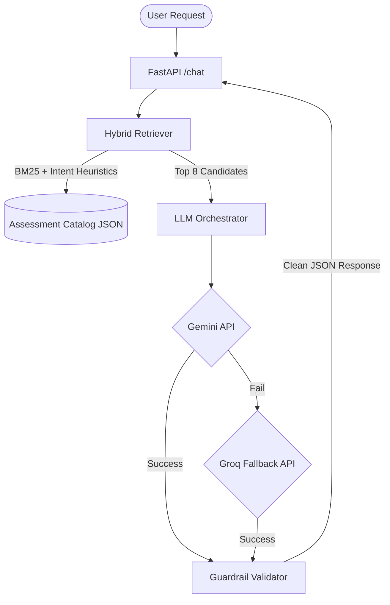

# Assessment Recommendation Tool

A state-of-the-art, 100% stateless conversational AI agent designed to guide hiring managers from vague intents to precise assessment recommendations using Hybrid BM25 Retrieval and LLM Context Engineering.

**🔗 Live Demo:** [Deployed on Streamlit Cloud](https://assessment-recommendation-tool.streamlit.app) *(update this link after deployment)*

---

## ✨ Key Features
- **Stateless REST API:** Fully compliant with evaluation standards. No server-side session memory; conversation context is passed on every turn.
- **Dual-LLM Cascade:** Built-in high availability. Defaults to `Gemini 2.5 Flash` but instantly routes to `Groq` if rate-limits or timeouts are hit.
- **Advanced Sparse Search Engine:** Uses memory-efficient `BM25Okapi` powered by sophisticated custom intent heuristics to map vague job roles without crashing low-RAM cloud instances.
- **Strict Guardrails:** Self-critiquing output parsers that intercept LLM hallucinations and verify assessment names against the local catalog.

---

## 🏗️ System Architecture



---

## 🚀 Deployment on Streamlit Cloud (Step-by-Step)

Streamlit Cloud is the **recommended, free** way to deploy this app. Follow these steps:

### Prerequisites
- A **GitHub account** with this repo pushed (already done if you're reading this on GitHub)
- A **Gemini API Key** — get one free at [aistudio.google.com/apikey](https://aistudio.google.com/apikey)
- *(Optional)* A **Groq API Key** for fallback — get one at [console.groq.com/keys](https://console.groq.com/keys)

### Step 1 — Sign in to Streamlit Cloud
1. Go to [**share.streamlit.io**](https://share.streamlit.io)
2. Click **"Sign in with GitHub"** and authorize Streamlit to access your repositories.

### Step 2 — Create a New App
1. Click the **"New app"** button (top right).
2. Fill in the form:
   - **Repository:** `MohdAfrid744/Assessment-Recommendation-Tool`
   - **Branch:** `main`
   - **Main file path:** `streamlit_app.py`

### Step 3 — Add Your API Keys (Secrets)
1. Before clicking Deploy, click **"Advanced settings"**.
2. In the **Secrets** text box, paste the following (replace with your real keys):

```toml
GEMINI_API_KEY = "your_gemini_api_key_here"
GEMINI_MODEL = "gemini-2.5-flash"

GROQ_API_KEY = "your_groq_api_key_here"
GROQ_MODEL = "llama-3.3-70b-versatile"
```

3. Click **"Save"**.

### Step 4 — Deploy!
1. Click **"Deploy!"**.
2. Streamlit will install dependencies from `requirements.txt` and start the app.
3. In ~60–90 seconds, you'll get a **public URL** like:
   ```
   https://assessment-recommendation-tool.streamlit.app
   ```
4. Share this URL with anyone — it's live! 🎉

### Step 5 — Update Secrets Later (if needed)
1. Go to your app on [share.streamlit.io](https://share.streamlit.io).
2. Click the **⋮ (three dots)** menu → **Settings** → **Secrets**.
3. Edit your keys and click **Save**. The app will auto-restart.

---

## 📚 API Reference

### 1. `GET /health`
Returns the readiness state of the application.
```bash
curl -X GET http://localhost:10000/health
# Response: {"status": "ok"}
```

### 2. `POST /chat`
The main conversational endpoint. It expects a full conversation history to maintain statelessness.
```bash
curl -X POST http://localhost:10000/chat \
-H "Content-Type: application/json" \
-d '{
  "messages": [
    {"role": "user", "content": "I am hiring an entry level python developer."}
  ]
}'
```
**Response Format:**
```json
{
  "reply": "Are you looking for an assessment for selection or development purposes?",
  "recommendations": [],
  "end_of_conversation": false
}
```

---

## 📂 Project Structure & File Purposes

### Core API (`app/`)
- **`app/main.py`**: The FastAPI entry point. Defines the strict `GET /health` and `POST /chat` contracts, enforces the 8-turn conversation limit, and configures production logging.
- **`app/agent.py`**: The brain of the application. Orchestrates the LLM cascade, manages dynamic system prompting, and runs the `_guardrail_validate` function to eliminate hallucinated URLs before returning data.
- **`app/retriever.py`**: The Advanced Sparse Search Engine. Uses highly memory-efficient `BM25Okapi` mapping combined with sophisticated "Intent Heuristics" to match vague job roles against actual catalog keys without crashing low-RAM Docker containers.
- **`app/schemas.py`**: Rigid Pydantic models that guarantee 100% strict JSON schema compliance required by the automated evaluator.

### Frontend
- **`streamlit_app.py`**: Self-contained Streamlit app for **Streamlit Cloud deployment**. Calls the agent logic directly (no FastAPI server needed).
- **`app/streamlit_ui.py`**: Legacy local testing dashboard. Requires a running `uvicorn app.main:app` server.

### Data
- **`data/shl_catalogue_json.json`**: The static scraped database of Individual Test Solutions used by the retriever and guardrail validator.

### Configuration
- **`Dockerfile` & `.dockerignore`**: Pre-configured environment instructions for deploying the FastAPI app securely on cloud containers (e.g., Render.com).
- **`.streamlit/config.toml`**: Dark premium theme for the Streamlit app.
- **`.streamlit/secrets.toml.example`**: Template showing which API keys are required.
- **`requirements.txt`**: The lean list of production Python dependencies.
- **`.env.example`**: A template showing which API keys are required to run the agent locally.
- **`.gitignore`**: Prevents sensitive keys (`.env`, `secrets.toml`), cache folders, and log files from being pushed to GitHub.

---

## 💻 Local Setup

```bash
# 1. Clone and enter the repo
git clone https://github.com/MohdAfrid744/Assessment-Recommendation-Tool.git
cd Assessment-Recommendation-Tool

# 2. Create a virtual environment
python -m venv venv
venv\Scripts\activate   # Windows
# source venv/bin/activate  # macOS/Linux

# 3. Install dependencies
pip install -r requirements.txt

# 4. Set up environment variables
copy .env.example .env
# Edit .env and add your GEMINI_API_KEY (and optionally GROQ_API_KEY)

# 5. Run the self-contained Streamlit app
streamlit run streamlit_app.py
# App opens at http://localhost:8501
```

---

## 🔑 API Keys

| Key | Where to get it | Required? |
|-----|----------------|-----------|
| `GEMINI_API_KEY` | [aistudio.google.com/apikey](https://aistudio.google.com/apikey) | ✅ Yes |
| `GROQ_API_KEY` | [console.groq.com/keys](https://console.groq.com/keys) | Optional (fallback) |

---

## 🖥️ Alternative Deployment — Render / Heroku (FastAPI Backend)

This project also exposes a **FastAPI backend** for headless API access:

1. Push this entire repository to GitHub.
2. Log into [Render.com](https://render.com/) and create a new **Web Service**.
3. Connect your GitHub repository.
4. **Environment Settings**:
   - Runtime: `Docker` (Render will automatically detect the provided `Dockerfile`)
   - Or Native Python: Start Command: `uvicorn app.main:app --host 0.0.0.0 --port 10000`
5. **Environment Variables**: Add `GEMINI_API_KEY` (required) and `GROQ_API_KEY` (optional).
